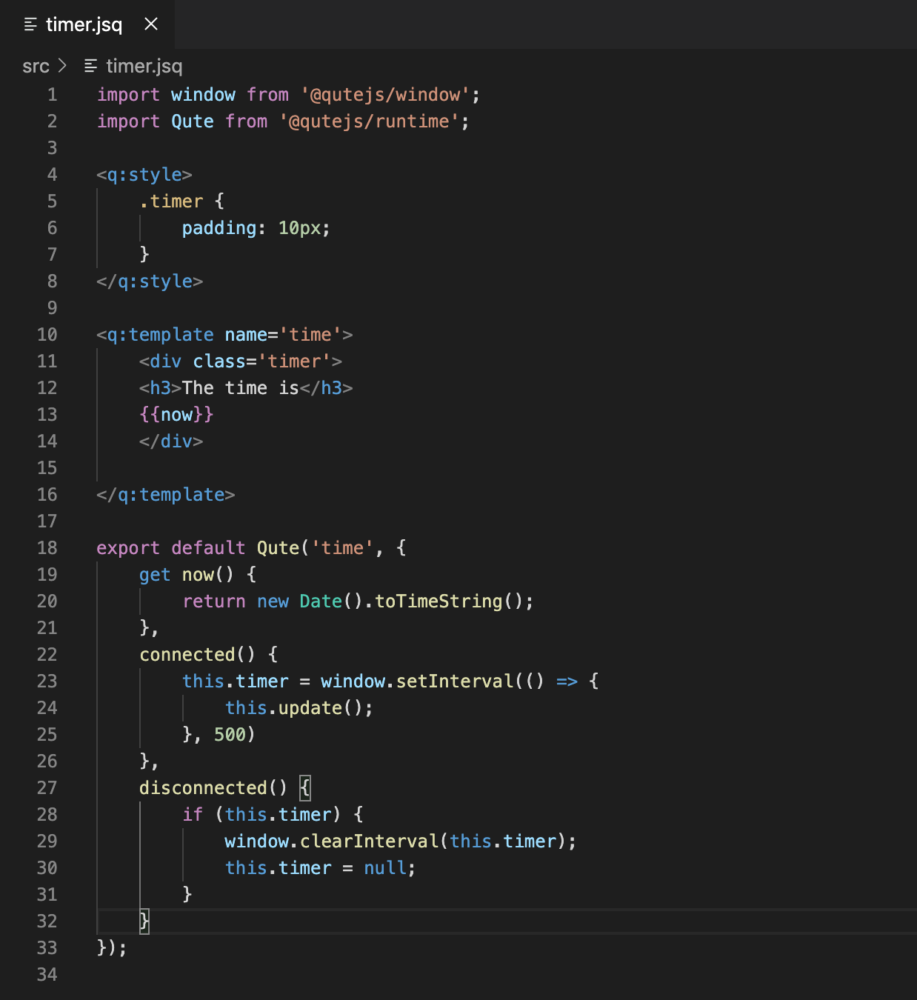
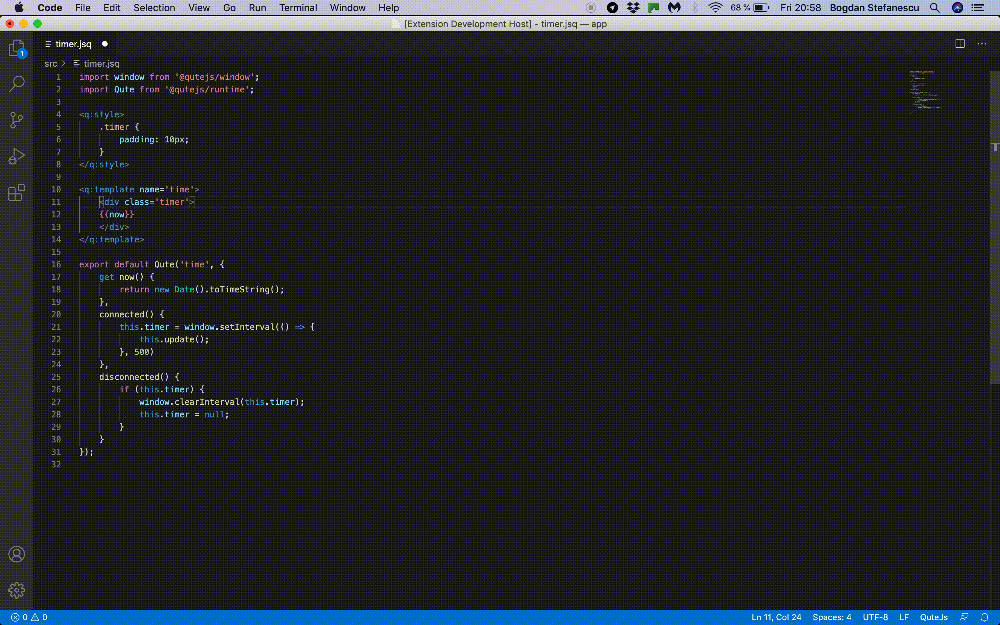

# Qute Components Support

This extension add support for [Qute](https://qutejs.org/) `.jsq` component files.

## Features

This extention provides the following features:

### Syntax highlightning for `.jsq` component files.

### Auto closing tags for HTML templates.

### Component preview in a WebView panel.

To preview a Qute component (i.e. a  `.jsq` file) you must `default export` the component to preview (since you can define multiple components in the same file the extension needs to known which compontent to preview). Then open the command palette and seartch for `Qute: Preview Component`.

### Development Server and debugging applications.

**Note** that These features are only available when generating the project using `npm init @qutejs`.

* Chrome Debugging (using pwa-chrome) through a custom launch.json configuration.
* Development Server with hot reload on save through a custom task.

## Extension Settings

This extension contributes the following settings:

* `qutejs.autoClosingTags`: Enable/disable autoclosing of HTML and QuteJs template tags.

* `qutejs.previewPanelStyle`: The style to use for the preview panel content. Example: `background:white;color:#333`

## Release Notes

### 0.9.0

Initial release
